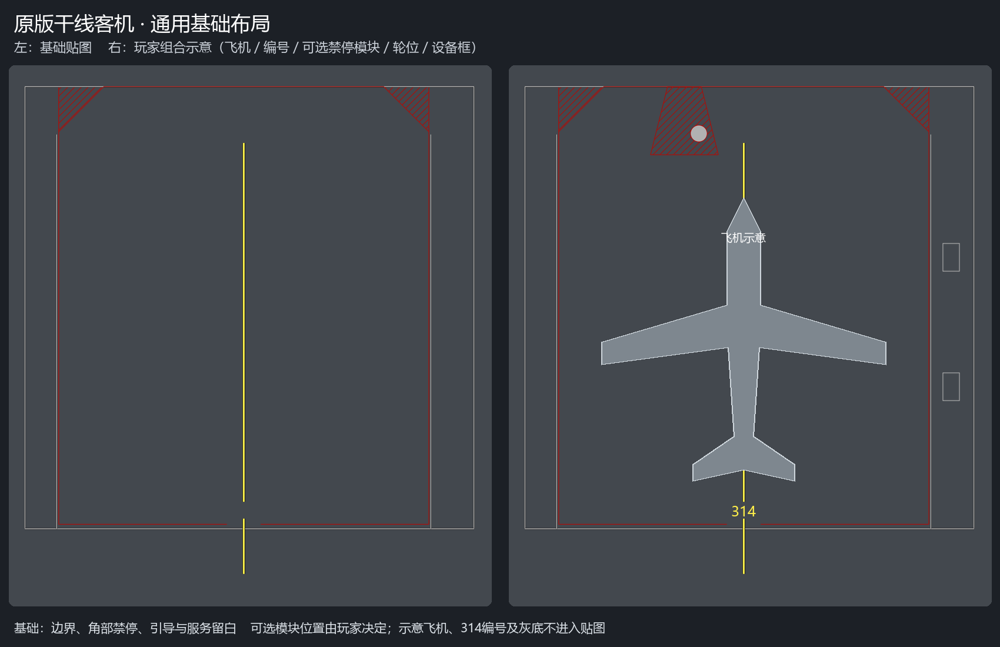
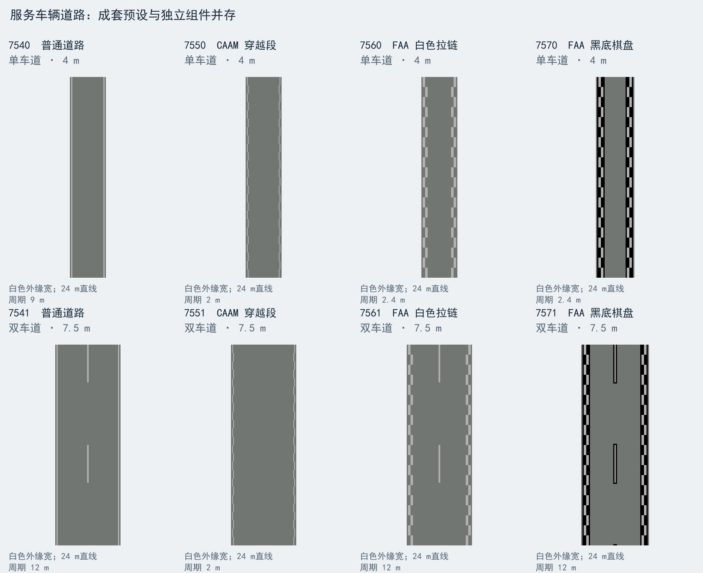

# Airport Details Pack Continued - 0.7.1.0 测试开发版

服务道路开发WIP版，在0.7.0.0基线上扩展，继承同作者的[Airport Details Pack](https://mods.paradoxplaza.com/mods/113207/Windows)，用于在Cities: Skylines II中组合机场地面标记与铺装。共 **520项：460 Decal、53 NetLane、7 Surface**，包括342个透明字符、跑道与滑行道标记、10种机坪基础及25项独立配套、背景与描边、混凝土与沥青材质、四色涂漆及红色禁停斜线。

**[0.7.0.0中文玩家指南](docs/manual/README.md)** · **[0.7.0.0 English player guide](docs/manual/README.en.md)** · **[0.7.0.0中文PDF](output/pdf/Airport-Details-Pack-Continued-0.7.0.0-Manual-zh-CN.pdf)** · **[0.7.0.0 English PDF](output/pdf/Airport-Details-Pack-Continued-0.7.0.0-Manual-en-US.pdf)** · [当前完整资产清单](docs/asset-catalog.csv)

本分支仅用于服务道路测试。新增内容见下方说明与[开发检查记录](docs/development-0.7.1.0.md)；正式玩家指南、PDF和发布配置等确认发布后再更新。

需要Extra Assets Importer（80529）、Extra Detailing Tools（80528）及它们所需的ExtraLib（75724）。发布配置为游戏1.6.*，作者当前使用1.6.2f。四类菜单保持为字符、道路贴花、道路线条、铺装。

先铺Surface，再绘制NetLane、放置Decal与字符。机坪基础及独立停止点、廊桥、轮位、设备框按实际飞机和场地组合。标记是静态造景组件，位置由玩家决定。作者字形与RGB177白色保持一致；ICAO为设计基准，地区图样与包内预设分别说明。



## 服务车辆道路

新增6个独立标线组件和8个成套预设。普通单车道4 m、双车道总宽7.5 m，另有CAAM白色交错、FAA白色拉链与黑底棋盘段；独立边线和分道线支持特殊宽度手搓。宽度是包内档位，白色标线外缘总宽不含黑边或透明留白。FAA双车道自带分道虚线；CAAM按图20-2中央留白。



[组件、尺寸和搭建说明](docs/service-roads.md) · [第十轮待测](docs/test-round-10.md)。0.7.1.0新道路尚待游戏验收，旧[第九轮](docs/test-round-9.md)仍保留待测。

## 推荐搭配

G87的铺装与道路标线、[Sully Airport Essentials Pack](https://mods.paradoxplaza.com/mods/117064/Windows)的机场地面Surface及跑道边缘，以及Airport Pack、LAX Airport Props和Runway Guard Light等机场道具均为可选推荐。按需、适量安装，遵循各包依赖和游戏版本要求；尚未全部完成联合适配测试。

## 开发和文档

本包持续维护，后续扩展服务车辆车道、用途明确的机坪标记和其他机场细节。发布长描述原文见[发布介绍](docs/publishing-description.md)。尺寸设计见[机坪说明](docs/stand-presets.md)，开发基线与验收记录见[实施说明](docs/ICAO-implementation.md)和[扩展交接](docs/airport-expansion-handoff.md)。

`asset-specs.json`管理米制尺寸、颜色、绘制层和优先级；`tools/asset_pipeline.py`生成资产、本地化及清单。几何模块为`apron_layouts.py`、`stand_presets.py`、`runway_netlanes.py`和`service_road_markings.py`。`SourceAssets`保存作者原图及SVG母版。资产描述按描述、规格、作用编排；工程目录参与资产身份，保持稳定。

```powershell
python -m pip install -r tools/requirements.txt
python tools/asset_pipeline.py --apply
python tools/asset_pipeline.py --check
python -m pip install -r tools/manual-requirements.txt
python tools/build_manual.py
```

生成器仅重写有变化的文件；不要重新`--bootstrap`。PDF构建需要reportlab和Pillow；字体自动查找Windows的SimHei，或设置`AIRPORT_MANUAL_FONT`指向可嵌入的中文TrueType字体。两种语言说明书及精灵图随清单重新生成，规范节选及来源记录保存在`docs/manual`。

本机官方Modding Toolchain构建：`./tools/build-local.ps1`；需要部署时由作者选择`-Deploy`。运行包将`CustomAssets`下的四个内容目录展开到DLL同级，Mod.cs仅调用EAI导入。素材母版和PDF不进入游戏运行资产目录。

本仓库以`v0.7.0.0`记录首个公开WIP内容。后续开发使用独立分支，main保存已整理的公开版本。公开包的最终打包和Paradox Mods发布由作者执行。
