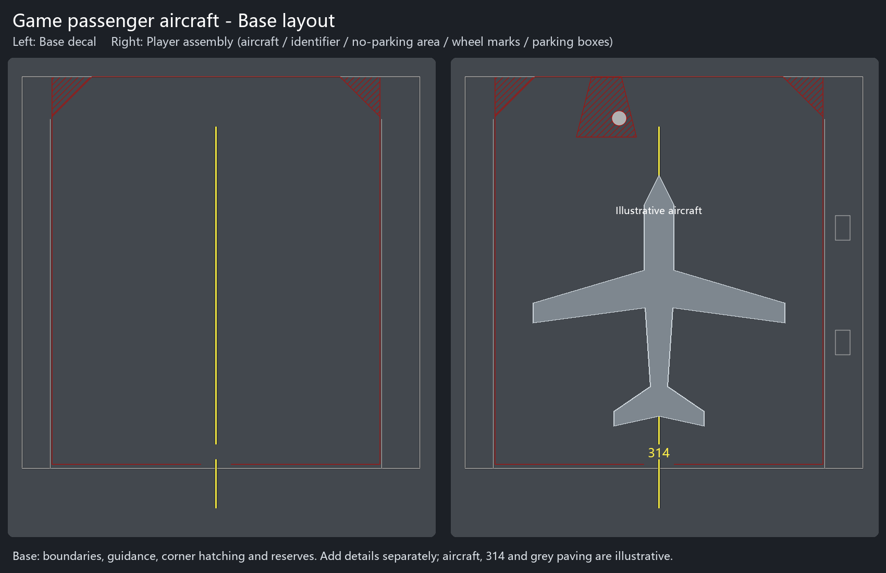

# Airport Details Pack Continued - Player Guide

[中文指南](README.md) · **English guide**

**0.7.0.0 - First public WIP release.** This pack provides modular airport ground markings and pavement: **506 assets, comprising 460 Decals, 39 NetLanes and 7 Surfaces**. The intended game series is 1.6.*; the creator currently uses 1.6.2f.

**[English PDF manual](../../output/pdf/Airport-Details-Pack-Continued-0.7.0.0-Manual-en-US.pdf)** · **[Chinese PDF manual](../../output/pdf/Airport-Details-Pack-Continued-0.7.0.0-Manual-zh-CN.pdf)**

Each illustrated PDF includes assembly workflows, excerpts from public standard figures, dimensions and applicability conditions, and a complete sprite atlas covering all 506 assets. Of these, 386 are additions to the original artwork baseline.

## Getting started

Enable Extra Assets Importer (80529), Extra Detailing Tools (80528), and their required ExtraLib dependency (75724). In EAI settings, enable the legacy Decal / NetLane importers, Surfaces and Localization. Assets appear in four menus: **Alphabet**, **RoadMarkings**, **RoadMarking** and **Pavement**.

1. Use a Surface to draw concrete or asphalt pavement.
2. Draw continuous lines, repeated markings or background strips with NetLanes. Start at the default scale.
3. Place runway marking blocks, apron bases and separate details as Decals.
4. Combine transparent characters, arrows, backgrounds and outlines to form identifiers and information markings.
5. Position stop datums, boarding-bridge movement areas, wheel marks and equipment boxes for the actual aircraft and props. Align one assembly before duplicating it as a group.

The aircraft, identifier and grey paving are illustrative. Apron bases leave room for separate details. Side reserves do not automatically define vehicle roads or permitted parking areas. All markings are static scenery components positioned by the player.

## Contents and dimensions

- [Complete CSV catalog](../asset-catalog.csv) / [JSON catalog](../asset-catalog.json): individual names, projection sizes, visible paint bounds, repeats, draw orders and sources.
- [Ten apron-base previews](../stand-preview-en.png): base layouts and optional no-parking modules. Appendix B of the English PDF lists the physical sizes, measured game-aircraft profiles and separate components.
- PDF appendices: the standard dimensions, regional patterns and package presets used in this edition. Each sprite card also lists its actual projection and visible paint bounds.

Visible paint bounds differ from the full projection, which includes transparent padding. Scaling changes stroke widths, spacing and repeats together. White uses RGB177/177/177; yellow uses RGB255/239/73. Fine-detail concrete and asphalt are the pavement materials included in this edition.

## Optional companion assets

[G87 Road Markings](https://mods.paradoxplaza.com/mods/97828/Windows) and G87's material packs provide ordinary road markings and more pavement choices. [Sully Airport Essentials Pack](https://mods.paradoxplaza.com/mods/117064/Windows) provides tiled airport Surfaces, runway-edge options and other airport details. Airport Pack, LAX Airport Props and Runway Guard Light add sign bodies, boarding bridges, buildings and lights.

These companion packs are **optional, not required dependencies**. They have not all been fully tested together with this edition. Add a moderate selection according to your needs, and follow each pack's own dependency and game-version requirements.

## Maintenance and documentation

Repository: [Airport_Next_Continued](https://github.com/lazy-red-panda-qw/Airport_Next_Continued). Use the catalog and PDFs in the corresponding Git tag for version-specific content. Development will continue with service-vehicle roads and airport markings with clearly defined purposes.

The PDFs are generated by `tools/build_manual.py` from the current catalog, parameters, apron geometry and standard-figure excerpts. Document editions, page numbers, source links and crop records are listed in the [source record](sources.json). This guide can also be copied to GitHub Wiki in the future; the current public documentation is maintained in the repository.
